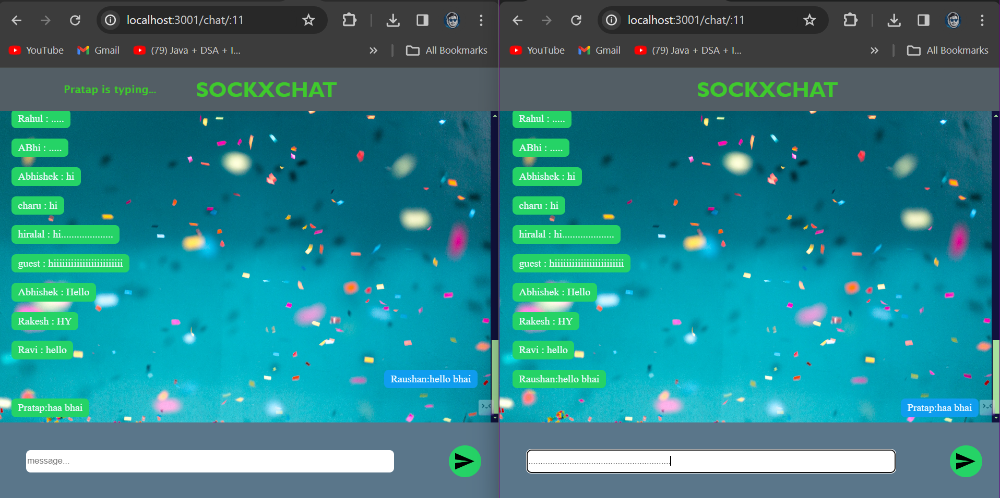

# WebSocket | Live Chat Application

## Preview


# SOCKXCHAT

SOCKXCHAT is a real-time chat application that allows users to communicate instantly in chat rooms. This application is built using Express.js, Socket.io, MongoDB, and EJS.

## Features

- **Real-Time Communication:** Messages are sent and received instantly, providing users with a seamless chatting experience.
- **Multiple Chat Rooms:** Users can join different chat rooms by specifying the room ID in the URL.
- **User Typing Indicator:** Shows typing indicator when a user is typing a message.
- **Persistent Storage:** Chat messages are stored in a MongoDB database, ensuring that messages are retained even if users leave the chat room or refresh the page.
- **Responsive Design:** The application is designed to be responsive and works well on various devices and screen sizes.

## Installation

 Clone the repository:

   ```
   git clone https://github.com/Abhishekbotx/WebSocket-Live-Chat-application-Project.git
   ```


1.Install dependencies:
```
npm install
```

2.Set up MongoDB:
 - **Ensure MongoDB is installed and running on your local machine.
 - **Update MongoDB connection details in config/database.js if necessary.
   
3.Start the server:
```
npm start
```
4.Access the application in your web browser:
```
http://localhost:3001
```
## Usage
 - Open the application in your web browser.
 - Enter your desired username in the input field provided.
 - Start chatting with other users in the chat room.
 - Optionally, you can join different chat rooms by specifying room IDs in the URL (/chat/:roomid).
 - Eg: ```http://localhost:3001/chat/2```
